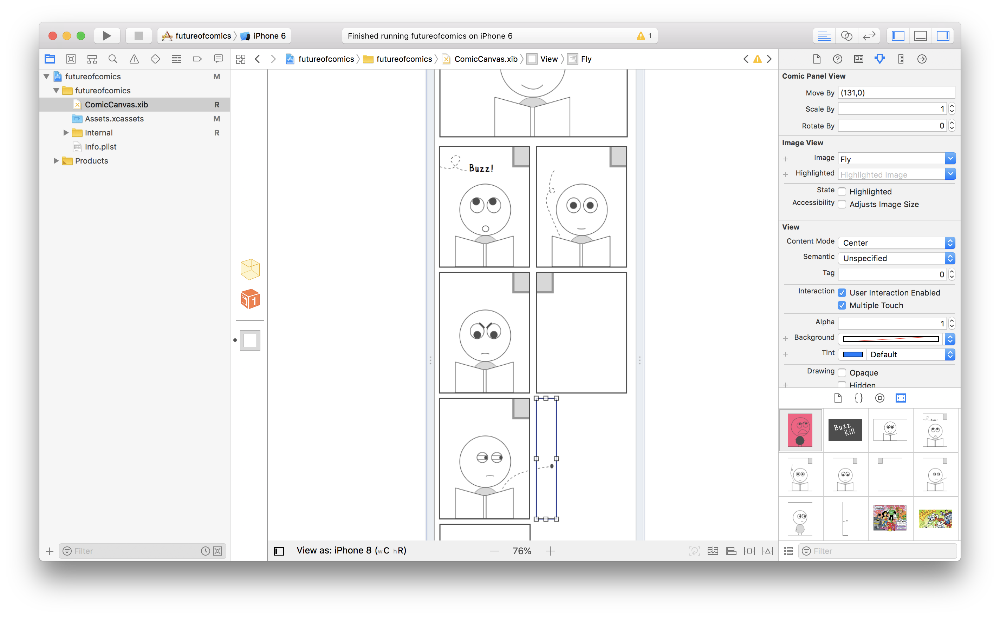
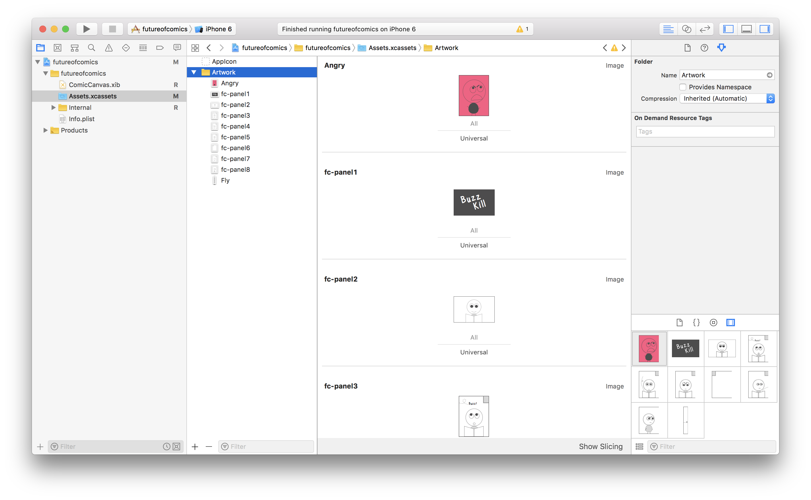
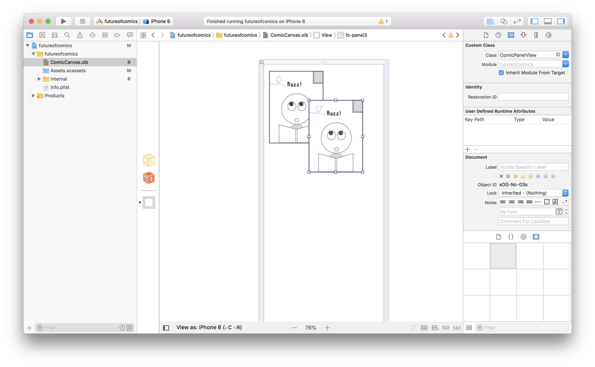
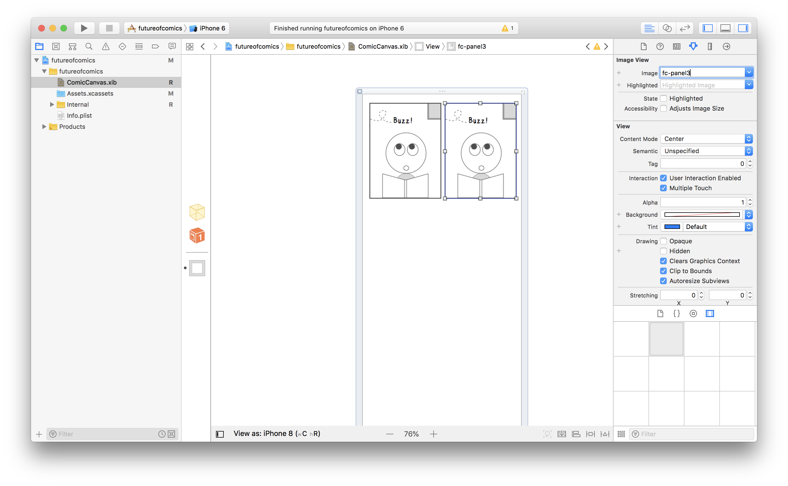
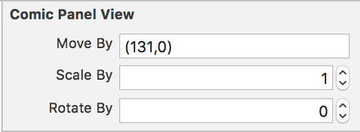

# Future of Comics: Creator Tool

## Introduction

Future of Comics is a my final thesis project for NYU's [Interactive Telecommunications Program](https://tisch.nyu.edu/itp).

My goal is empowering Comics creators and artists and help them  find new ways to tell their stories in mobile platforms, along with opening to new global audiences.

This Creator Tool is an open source project built for Xcode that makes easy to build interactive comic books for iPhone.

## Features

- Builds the Comic book as an iPhone app, which you can publish it directly to the App Store.
- Lets you specify any layout you want, in an infinite scrolling canvas
- Lets you set interactions to each comic book panel, which will get trigger when the reader scrolls through the story.
- Can be scale with more custom interactions (Some programming required)

## Prerequisites

- A Mac with macOS High Sierra. You can update your macOS version [here]()
- Latest Xcode installed. Download it [here]()
- A paid iOS Developer account (if you want to publish to the App Store). More info [here]()
- Your artwork in .jpg or .png (1 file per panel)

## 1. Adding your artwork

Double click *futureofcomics.xcodeproj* file to open it on Xcode. 

Drag and drop them to the "Artwork" folder inside Assets.xcassets, from the left sidebar of Xcode. Make sure all your files have unique names.

## 2. Laying out your comics

Select ComicCanvas.xib from the left sidebar. You'll find an example panel already placed.

Duplicate this panel with either CMD+C->CMD+V or by holding OPTION and dragging.

On the right panel, write the panel's name you want to show. You can also select one from the list.

You can change the position and size of your panel as well.

## 3. Adding interactions to your panels

Select one panel on ComicCanvas.xib. On the right sidebar, make sure the 4th tab is selected.

You'll find 3 properties you can play with:

- **Move By**: Specify the final number of points (in a *x,y* format) you want the panel to move when the user scrolls. Example values: 40,0   23,100   -50,10  
- **Scale By**: Specify the final scale (being 1 the original scale) the panel should have when the user scrolls. Example values: 0.5   1.8   2.0
- **Rotate By**: Specify the final angle (in degrees) the panel should rotate. Example values: 45   180   -30

All the final values will be reached **continuously** on scrolling.

## 4. Preview your comic

If you want to have a taste of the final product, go to the top bar, select one device and click the Play icon

## 5. Publish to the App Store

Apple has a great resource page for explaining how to publish directly from Xcode to the App Store.

[https://developer.apple.com/app-store/submissions/](https://developer.apple.com/app-store/submissions/)
